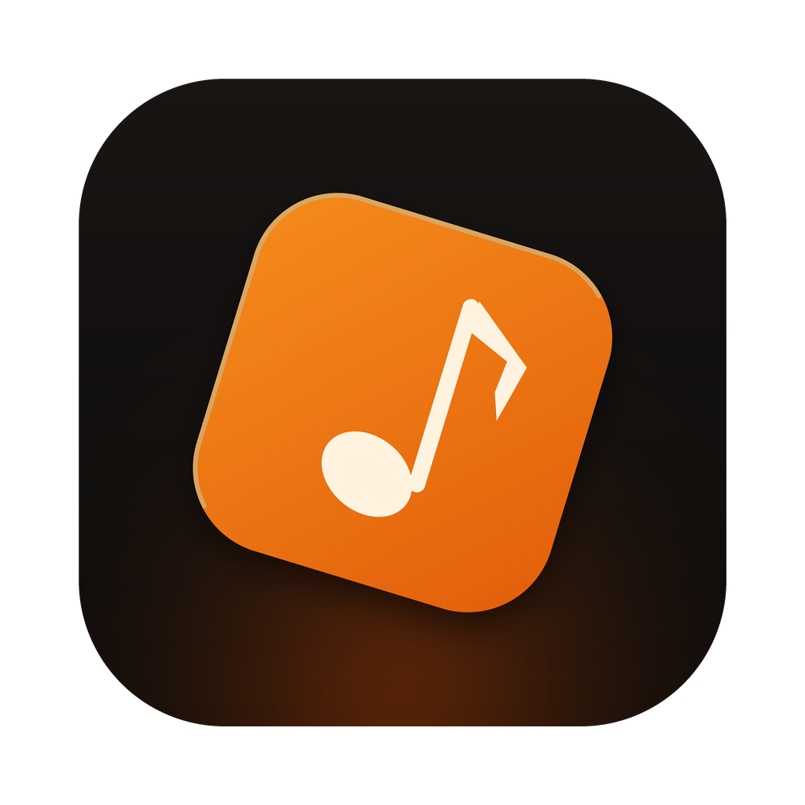
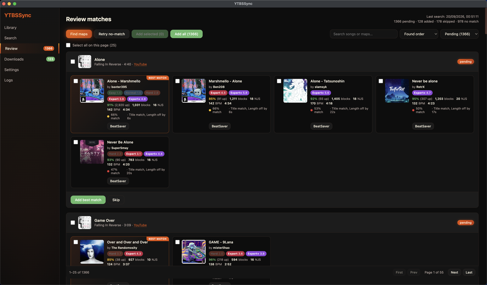

<p align="center">
  
</p>

<h1 align="center">YTBSSync</h1>

<p align="center">
  Turn your YouTube Music liked songs into a Beat Saber library.<br />
  Match, review by hand, install.
</p>

<p align="center">
  <a href="https://github.com/SolberLight/Youtube-BeatSaber-Sync/releases/latest"></a>
  
  <a href="LICENSE"></a>
</p>

---

<p align="center">
  
</p>

## What it does

You like a lot of songs. Some of them have great Beat Saber maps. Finding out
which ones — one BeatSaver search at a time — is tedious.

YTBSSync reads your liked songs, searches BeatSaver for each one, scores every
result against the track, and shows you the good candidates as cards. You tick
the maps you want and hit **Add**; they download in the background and land in
your `CustomLevels` folder, ready to play.

Your Add/Skip choices are remembered, so you can work through a big library
across several sittings and never be asked about the same song twice.

## Install

Grab the latest build from [**Releases**](https://github.com/SolberLight/Youtube-BeatSaber-Sync/releases/latest):

| Platform | File |
| --- | --- |
| macOS (Apple Silicon) | `YTBSSync-*-arm64.dmg` |
| macOS (Intel) | `YTBSSync-*.dmg` |
| Windows | `YTBSSync-Setup-*.exe` |

> **These builds are not code-signed**, so your OS will warn you on first launch.
> On macOS, right-click the app → **Open** (or run
> `xattr -dr com.apple.quarantine /Applications/YTBSSync.app`).
> On Windows, SmartScreen → **More info** → **Run anyway**.

## How it works

1. **Sync likes** — signs into YouTube Music in a normal browser window and
   pulls your liked songs.
2. **Find maps** — searches BeatSaver for each song and scores every result.
3. **Review** — tick the maps you want, then **Add** or **Skip**.
4. **Download** — accepted maps download in parallel and extract into your
   `CustomLevels` folder.

### Reviewing while it searches

A full pass over a large library takes a while, so you don't wait for it.
Results appear as they're found, and the progress bar shows position, the song
being searched, and an ETA from a rolling window of recent timings.

The list is ordered **least recently found first**, so new results append to the
bottom while you review from the top. That order is keyed on when a song was
*first* found and survives re-searches — nothing you're part-way through reading
ever shifts underneath you. **Cancel** is always safe; everything found is kept.

### One-off lookups

You don't have to sync your whole library. **Search** queries YouTube Music
directly and gives each hit a **Find maps** button that runs the matcher for
just that song.

It's also the cleanest fix for a song whose album version trips the length
filter — search the exact version you want and match against that.

### Previewing a map

Hover a card and a play button appears over the cover art, streaming BeatSaver's
own preview clip. Confirm it's the right song — and the right *version* — before
adding it.

## Matching

Each candidate gets a confidence score from three signals:

- **Title** similarity against the map's song name and display name
- **Artist** similarity against the map's song author
- **Length** proximity to the YouTube track

YouTube titles are de-noised first, so `Take On Me [Official Music Video]`
compares cleanly. Version-bearing parentheticals like `(Acoustic)` are kept on
purpose — they're the difference between the right map and the wrong one.

A map must clear every filter to be offered: minimum difficulty, rating, votes,
game modes, length tolerance and confidence. On top of that, a candidate whose
**title** barely matches is rejected no matter how well everything else lines
up — that combination is almost always *a different song by the same artist*.

### Ordering

Candidates are listed by match confidence, and the top one is marked
**Best match**. When two are equally confident a **curated** map comes first,
then a **ranked** one, then the rest by rating and popularity — so between two
100% matches you get the curated one.

Confidence is compared on the percentage shown on the card, so the list can
never put a lower percentage above a higher one.

## Sources

BeatSaver is the primary source and the only one that actually hosts downloads.
The others are fallbacks, consulted only when a plain search finds nothing:

| Source | Role |
| --- | --- |
| **BeatSaver** | Text search, full map metadata, downloads |
| **BeastSaber** | The curated pool, via BeatSaver's `curated` flag. `bsaber.com` no longer exposes a public API — it's now a front-end over BeatSaver's data |
| **ScoreSaber** | Leaderboard search, resolved back to real maps through BeatSaver's `/maps/hash/{hash}`. Catches songs indexed under a name BeatSaver's text search misses |

## Settings

| Setting | Default |
| --- | --- |
| Minimum difficulty | **Expert** |
| Minimum rating | **80%** |
| Minimum votes | 10 |
| Game modes | Standard |
| Length tolerance | 30s |
| Minimum match confidence | 45% |
| Prefer curated and ranked maps | on |
| Exclude AI / automapped | on |
| Candidates per song | 5 |
| Maps folder | your Beat Saber `CustomLevels` folder |
| Parallel downloads | 3 |

Plus six skins, because why not.

> If a song you expected comes back as **no match**, the usual culprit is length
> tolerance — YouTube often serves an album version minutes longer than any map.
> Widen it, then hit **Retry no-match**.

## Downloads

Maps download through a fixed-size worker pool, so one slow download never holds
up a bulk **Add all**. Each archive extracts into `<key> (<song> - <mapper>)`,
the convention Beat Saber and ModAssistant both expect, and every archive entry
is validated before anything is written.

Downloads survive a quit — anything still queued resumes on next launch.

## Privacy

Everything stays on your machine. There is no backend, no telemetry, and no
account beyond your own YouTube Music session.

Your session cookies are stored via Electron's `safeStorage` (encrypted with a
key held in your OS keychain where available). The app talks to exactly three
hosts: YouTube Music, BeatSaver and ScoreSaber.

App data lives in Electron's `userData` folder (**Settings → Advanced → Open app
data folder**):

| File | Contents |
| --- | --- |
| `config.json` | Your settings |
| `auth.json` | YouTube Music cookies, encrypted |
| `library.json` | Cached liked songs, plus anything added from Search |
| `matches.json` | Candidates, discovery order and your Add/Skip decisions |
| `downloads.json` | Installed maps, keyed by map id |
| `queue.json` | Pending/active/failed download jobs |

Unliking a song on YouTube never deletes its local record, so the decision
attached to it survives.

## Build from source

**Prerequisites:** Node.js 20+

```bash
git clone https://github.com/SolberLight/Youtube-BeatSaber-Sync.git
cd Youtube-BeatSaber-Sync
npm install
npm run dev        # Vite dev server + Electron
```

```bash
npm run typecheck  # all three TS projects
npm run build      # compile main + preload, bundle renderer
npm run dist       # package installers into release/
```

See [DEVELOPING.md](DEVELOPING.md) for architecture notes and the gotchas worth knowing
before changing anything.

## Tech stack

Electron · React · Vite · TypeScript · [`youtubei.js`](https://github.com/LuanRT/YouTube.js) ·
[`fflate`](https://github.com/101arrowz/fflate) · `zod` · `electron-log`

Built on the scaffold of [YTM2Local](https://github.com/SolberLight/ytm2local),
which it reuses for YouTube Music sign-in, the liked-songs fetch, storage and the
skin system.

## License

[MIT](LICENSE)
